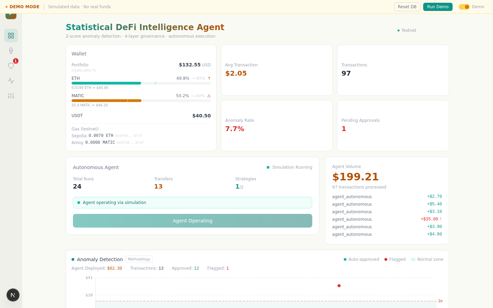

# Statistical DeFi Intelligence Agent

[](LICENSE)
[](#testing)
[](https://nodejs.org)

**Autonomous DeFi agent with Six Sigma anomaly detection and 4-layer governance pipeline — because AI agents that handle money need statistics, not vibes.**

> Hackathon Galactica 2026 | Track: Autonomous DeFi Agent + Agent Wallets | Built with [Tether WDK](https://docs.wdk.tether.io)



---

## The Problem

AI agents are learning to spend money. But who watches the agent?

Most "agent + wallet" solutions give the agent a wallet and cross their fingers. There are no spending limits, no anomaly detection, no audit trail. Some ask the LLM to decide if a transaction is "suspicious" — that's not reproducible, not auditable, and not how financial risk management works.

## Our Solution

SigmaGuard is an autonomous DeFi agent that executes financial strategies (DCA, portfolio rebalancing via DEX swaps, yield farming on Aave) through a **4-layer governance pipeline** inspired by **Six Sigma statistical quality control**:

| Layer | Role | How |
|-------|------|-----|
| **1. Fixed Rules** | Hard limits (max amount, daily caps, asset whitelist) | JSON policies in database |
| **2. Statistical Anomaly Detection** | Flags outliers using proven statistics | Z-score + IQR, computed dynamically over transaction history |
| **3. AI Interpreter** | Explains decisions in plain language | Claude (interprets, never decides) |
| **4. Human-in-the-Loop** | Final say on anything flagged | Realtime approval dashboard |

### Why statistics, not LLM?

The anomaly detection engine computes **Z-scores and IQR** dynamically from the last 200 transactions. Mean and standard deviation are calculated with Bessel's correction (n−1). This is the same methodology used in industrial quality control, financial risk management, and fraud detection.

| | LLM-based detection (competitors) | SigmaGuard's statistical detection |
|--|---|---|
| **Reproducibility** | Ask twice, get different answers | Same data = same result, always |
| **Auditability** | "The AI thinks it's suspicious" | "z-score = 3.2, exceeds ±2σ threshold" |
| **Speed** | API call (~1-3s) | Instant calculation (~1ms) |
| **Cost** | Token cost per evaluation | Zero — pure math |
| **Defensibility** | Cannot explain to a regulator | Standard statistical methodology |

**The key insight:** The LLM does NOT decide if a transaction is risky. The statistical model decides. The LLM translates:

> *"This $35 rebalance swap is 3.2 standard deviations above your average of $3.80 for agent operations. The market crashed 18%, triggering an emergency portfolio rebalance via Velora DEX. Do you want to approve?"*

## Prerequisites

- **Node.js >= 18** (recommended: 20 LTS)
- **npm >= 9**
- A Supabase instance (cloud or self-hosted)
- Anthropic API key (for the Claude LLM interpreter layer)

## Quick Start (< 5 minutes)

```bash
git clone https://github.com/ronaldmego/sigmaguard.git
cd sigmaguard
npm install
cp .env.example .env   # Fill in Supabase + Anthropic + WDK keys
npm run db:setup        # Create schema + tables
npm run seed            # 84 transactions + 5 rules + 2 strategies
npm run dev             # Dashboard at http://localhost:4007
```

### See it in action (Demo Mode — zero terminal)

Open the dashboard → click the toggle to **Demo Mode** → click **Reset DB** → click **Run Demo**.

The simulation compresses 24h of autonomous agent activity into ~3 minutes:
- DCA transfers appearing in the transaction feed in realtime
- Agent Volume card climbing with each operation
- Scatter chart plotting each transaction against the normal zone (μ ± 2σ)
- A **market crash at tick 8** triggers a $35 emergency rebalance swap
- Governance flags it (z-score: 3.2) → hover the red dot to see the z-score
- Click "Methodology" on the chart to see live statistical formulas
- Approve or reject the flagged transaction from the Approval Queue

No terminal needed. No API keys needed for demo mode.

## Architecture

```
┌─────────────────────────────────────────────────┐
│              Dashboard (Next.js)                 │
│  Wallet │ Agent Volume │ Anomaly Chart │ Approvals│
└────────────────────┬────────────────────────────┘
                     │ Realtime (Supabase WebSocket)
┌────────────────────▼────────────────────────────┐
│              Autonomous Agent Loop               │
│  Market Data → Strategy → Decision → Governance  │
│                                                  │
│  Strategies:                                     │
│  • DCA — periodic buys at fixed intervals        │
│  • Rebalance — DEX swap via Velora when drifted  │
│  • Yield — park idle USDT in Aave V3 lending     │
└────────────────────┬────────────────────────────┘
                     │
┌────────────────────▼────────────────────────────┐
│      4-Layer Governance Pipeline (Six Sigma)     │
│                                                  │
│  1. Rules Engine    → hard limits, caps          │
│  2. Anomaly Detector → Z-score + IQR (dynamic)  │
│     μ, σ from last 200 txs, Bessel's correction  │
│  3. LLM Interpreter → human-readable explain     │
│  4. Human Review    → approve/reject flagged     │
└────────────────────┬────────────────────────────┘
                     │
┌────────────────────▼────────────────────────────┐
│              Tether WDK (4 modules)              │
│  Wallet │ Swap (Velora) │ Lending (Aave V3)      │
│  Ethereum Sepolia + Polygon Amoy (testnet)       │
└─────────────────────────────────────────────────┘
```

## How the Agent Works

```
Every 120 seconds, the agent:
  1. Fetches live market data (ETH, MATIC prices via CoinGecko)
  2. Evaluates active strategies:
     • DCA: Is it time to buy? → Transfer fixed amount to vault
     • Rebalance: Has portfolio drifted >15%? → Swap via Velora DEX
     • Yield: Is USDT sitting idle? → Supply to Aave V3 lending pool
  3. If action needed → enters 4-layer governance pipeline
     • Normal trade (z-score < 2σ) → auto-approved, executed via WDK, logged
     • Anomalous trade (z-score > 2σ or IQR outlier) → flagged, queued for human
  4. All decisions recorded with full audit trail in Supabase
```

The agent is **truly autonomous** — it starts, evaluates, decides, and executes without human intervention. Humans only get involved when governance flags something unusual.

## Statistical Methodology

The anomaly detection engine implements two complementary methods:

**Z-score (primary):** `z = (x - μ) / σ` — measures how many standard deviations a transaction deviates from the historical mean. Threshold: |z| > 2.0 (95.4% confidence interval).

**IQR (secondary):** Interquartile Range using Q1/Q3 percentiles. Outlier if x < Q1−1.5·IQR or x > Q3+1.5·IQR. Robust against non-normal distributions.

A transaction is flagged if **either** method detects it as anomalous. The dashboard visualizes this as a scatter chart with a normal zone band (μ ± 2σ), where each point shows its individual z-score on hover. Click "Methodology" on the chart to see live computed statistics.

**Implementation details:** `src/lib/utils/math.ts` (pure functions, 22 tests) + `src/lib/governance/anomaly.ts` (detection engine). Sample standard deviation uses Bessel's correction (n−1). Cold start protection: minimum 5 historical transactions required before flagging.

## Stack

| Component | Technology | Why |
|-----------|-----------|-----|
| Frontend | Next.js 14 (App Router) | SSR + API routes in one runtime |
| Database | Supabase (PostgreSQL) | Realtime subscriptions + append-only audit trail |
| Wallet | Tether WDK (4 modules) | Self-custodial wallets, DEX swap, Aave lending |
| DEX | Velora (via WDK) | Token swaps for portfolio rebalancing |
| Lending | Aave V3 (via WDK) | Yield farming for idle stablecoins |
| Anomaly Detection | Z-score + IQR (Six Sigma) | Deterministic, reproducible, auditable |
| AI Agent | Claude (Anthropic) | Interprets and explains, never decides |
| Chains | Ethereum Sepolia + Polygon Amoy | Testnet by default, always |

## What Makes This Different

| Typical Agent Wallet | SigmaGuard |
|---------------------|------|
| Agent has wallet, no controls | Agent has wallet + 4-layer governance |
| LLM decides if "suspicious" | Statistical model detects anomalies (Z-score/IQR) |
| Not reproducible | Deterministic: same data = same result |
| No audit trail | Every decision logged with full context in Supabase |
| Manual trigger required | Fully autonomous loop with human escalation |
| Single chain | Multi-chain (Ethereum + Polygon) |
| Dark terminal output | Premium light-mode dashboard with anomaly visualization |
| Requires funded wallet to demo | One-click demo mode, zero terminal, no API keys |

## Project Structure

```
src/
├── app/                    # Next.js pages + 14 React components
│   ├── components/         # Dashboard, Agent Panel, Approval Queue, AgentVolume...
│   └── api/                # REST endpoints (transactions, rules, agent)
├── lib/
│   ├── governance/         # 4-layer pipeline (rules, anomaly, agent, pipeline)
│   ├── utils/              # Statistical functions (mean, stdDev, zScore, IQR)
│   ├── agent/              # Autonomous loop (strategies, market data)
│   ├── wdk/                # Tether WDK (wallet, swap, lending)
│   └── db/                 # Supabase client + queries
├── types/                  # TypeScript definitions
scripts/
├── seed.ts                 # Demo data (84 txs + 5 rules + 2 strategies)
├── simulate.ts             # 24h agent simulation in ~3 minutes
tests/                      # 111 tests (governance, agent, swap, lending, math)
migrations/                 # SQL schema (6 tables + RLS)
```

## Testing

```bash
npm test                    # All 111 tests
npm run test:governance     # Governance pipeline (64 tests)
npm run test:agent          # Autonomous agent + swap + lending (25 tests)
npm run test:math           # Statistical functions (22 tests)
```

## Environment Variables

```bash
# Supabase (PostgreSQL + Realtime)
NEXT_PUBLIC_SUPABASE_URL=http://localhost:54321
SUPABASE_URL=http://localhost:54321
NEXT_PUBLIC_SUPABASE_ANON_KEY=your_anon_key
SUPABASE_SERVICE_ROLE_KEY=your_service_role_key

# Tether WDK
WDK_SEED_PHRASE=            # Testnet only — never commit real seeds
WDK_NETWORK=testnet

# Anthropic (Claude LLM interpreter layer)
ANTHROPIC_API_KEY=sk-ant-...

# App
NEXT_PUBLIC_APP_URL=http://localhost:4007
```

## Team

Built by [Ronald Mego](https://ronaldmego.com) — Statistical Engineer & Founder @ [GalacticaIA](https://galacticaia.com). 15+ years in data governance, statistical analysis, AI, and enterprise systems.

## License

Apache 2.0
